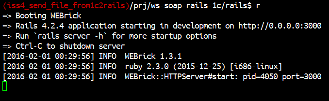
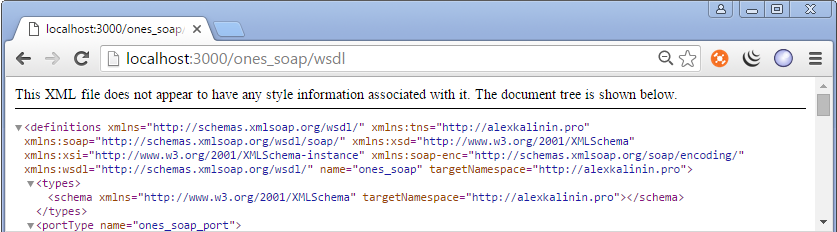
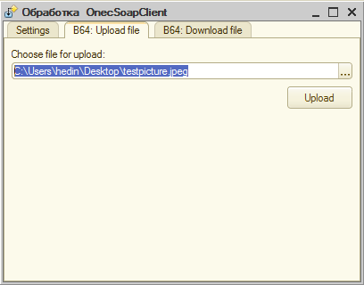
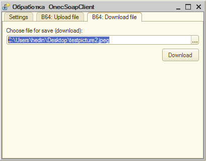

[](https://codeclimate.com/repos/5731719ed19eee0082006e65/feed)

***

### NOTE FOR ENGLISH-SPEAKING
This project was developed mainly for integration Ruby on Rails with [1C Enterprise 8](http://www.1c.ru/eng/title.htm) system. The writing of code in 1C is fully in Russian and 99% for Russian-speaking customers. That is why I don't see the reason to develope this project in English. 

If you have questions, please feel free ask me by writing on my email: login.hedin@gmail.com. 

Another my contacts and info about me, you can find out at [alexkalinin.pro](http://alexkalinin.pro)

***


## Ruby on Rails SOAP Server + 1C:Предприятие 8 SOAP Client


## Задачи проекта

* Реализовать SOAP веб-сервис на Ruby on Rails
* Реализовать SOAP-клиента с помощью 1C:Предприятие 8
* Проверить возможность передавать/получать строки, числа, небольшие файлы (до 100Мб)


### SOAP веб-сервис на Ruby on Rails

Задачу реализации SOAP-сервиса удалось решить благодаря gem-у **wash_out** ([rubygems](https://rubygems.org/gems/wash_out), [github](https://github.com/inossidabile/wash_out/))


### SOAP-клиент с помощью 1C:Предприятие 8

У 1С8 есть возможность подключаться к [SOAP-веб-сервисам](http://v8.1c.ru/overview/Term_000000273.htm) и к [REST-веб-сервисам](http://its.1c.ru/db/metod8dev/content/3790/hdoc). Я выбрал SOAP, т.к. он удобнее реализован в 1С + он удобнее в разрезе передачи разных примитивных данных (строки, числа...), а также благодаря возможности передачи довольно больших строк (до [100Мб](https://github.com/AlexKalinin/1c8-base64-file-decoder-encoder)) - можно передавать / получать также любые файлы, закодированные в [base64](https://github.com/AlexKalinin/1c8-base64-file-decoder-encoder). 

Примечание: если Вам все-же нужно научить 1С выполнять прием/передачу данных по REST (например, если есть необходимость передавать файлы больше 100Мб), то можно посмотреть пример обработки [_vendors/OnesSendReceiveFileWithREST.epf](_vendors/OnesSendReceiveFileWithREST.epf) которая была загружена отсюда: http://forum.aeroion.ru/topic446.html


## Как развернуть локально

RoR-часть запускается стандартно, командами:

```
cd rails/
bundle install
rails s -b 0.0.0.0 -p 3000
```

После сообщений:



можно запустить браузер и проверить, доступен ли WSDL SOAP-сервиса:




Для развертывания 1С-части достаточно в пустой 1С-базе (режим "Обычное приложение") запустить обработку [1c8/OnecSoapClient.epf](1c8/OnecSoapClient.epf).

Исходя из WSDL-схемы нужно прописать настройки:


Затем можно попробовать отправить по SOAP файл в виде base64-строки:



и принять его обратно:



Также можно убедиться что файл не был поврежден при приеме/передаче

```
md5sum original.png uploaded.png downloaded.png
87f7b976523270929007e4583e05919a original.png 
87f7b976523270929007e4583e05919a uploaded.png 
87f7b976523270929007e4583e05919a downloaded.png

```


## Список использованной литературы (ресурсов)

* [Web-сервисы из 1С в PHP](http://infostart.ru/public/63082/) (форум)
* [Доступ к SOAP веб-сервисам 1С из JavaScript и Html](http://habrahabr.ru/post/184540/) (habr)
* [SOAP, wikipedia](https://en.wikipedia.org/wiki/SOAP)
* Стандарт SOAP [1](http://www.w3.org/TR/2007/REC-soap12-part0-20070427/),
    [2](http://www.w3.org/TR/2007/REC-soap12-part1-20070427/), 
    [3](http://www.w3.org/TR/2007/REC-soap12-part2-20070427/),
    [4](http://www.w3.org/TR/2007/REC-soap12-testcollection-20070427/)
* SOAP средствами Ruby on Rails:
    * http://habrahabr.ru/company/roundlake/blog/135614/ - SOAP-сервер на Rails 3.x (WashOut)
    * https://github.com/inossidabile/wash_out - gem WashOut (rails soap service)
* 1С как клиент для SOAP-вебсервиса:
    * http://habrahabr.ru/post/148658/ - Использование внешних веб-сервисов в 1С на примере загрузки курсов валют
    * http://howknow1c.ru/programmirovanie-1c/ws-ssylki-1s.html  - WS-ссылки 1С
    * http://start1c.blogspot.com/2012/09/ws.html - WS-ссылки 1С
* https://github.com/inossidabile/wash_out - Библиотека WashOut
* https://github.com/AlexKalinin/v8unpack -- для распаковки 1С .cf (файла конфигурации)
* [php-заглушка для теста веб-сервиса из 1С](http://fragster.ru/tmp/test.php?wsdl)
