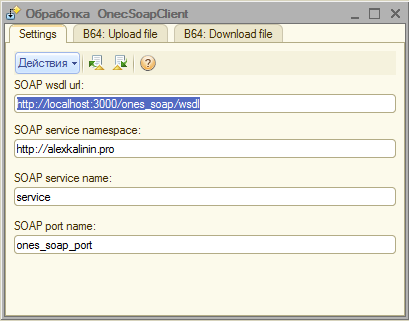

***

### NOTE FOR ENGLISH-SPEAKING
This project was developed mainly for integration Ruby on Rails with [1C Enterprise 8](http://www.1c.ru/eng/title.htm) system. The writing of code in 1C is fully in Russian and 99% for Russian-speaking customers. That is why I don't see the reason to develope this project in English. 

If you have questions, please feel free ask me by writing on my email: login.hedin@gmail.com. 

Another my contacts and info about me, you can find out at [alexkalinin.pro](http://alexkalinin.pro)

***


## Ruby on Rails SOAP Server + 1C:Предприятие 8 SOAP Client


## Задачи проекта

* Реализовать SOAP веб-сервис на Ruby on Rails
* Реализовать SOAP-клиента с помощью 1C:Предприятие 8
* Проверить возможность передавать/получать строки, числа, небольшие файлы (до 100Мб)


### SOAP веб-сервис на Ruby on Rails

Задачу реализации SOAP-сервиса удалось решить благодаря gem-у **wash_out** ([rubygems](https://rubygems.org/gems/wash_out), [github](https://github.com/inossidabile/wash_out/))


### SOAP-клиент с помощью 1C:Предприятие 8

У 1С8 есть возможность подключаться к [SOAP-веб-сервисам](http://v8.1c.ru/overview/Term_000000273.htm) и к [REST-веб-сервисам](http://its.1c.ru/db/metod8dev/content/3790/hdoc). Я выбрал SOAP, т.к. он удобнее реализован в 1С + он удобнее в разрезе передачи разных примитивных данных (строки, числа...), а также благодаря возможности передачи довольно больших строк (до 100Мб) - можно передавать / получать также любые файлы, закодированные в base64. 


## Как развернуть локально

RoR часть запускается стандартно, командами:

```
cd rails/
bundle install
rails s -b 0.0.0.0 -p 3000
```

После сообщений:


можно запустить браузер и проверить, доступен ли WSDL SOAP-сервиса:


Для развертывания 1С-части достаточно запустить в пустой 1С-базе (режим "Обычное приложение") запустить обработку [1c8/OnecSoapClient.epf](1c8/OnecSoapClient.epf).

Исходя из WSDL-схемы нужно прописать настройки:



Затем можно попробовать отправить по SOAP файл в виде base64-строки:


и принять его обратно:


Также можно убедиться что файл не был поврежден при приеме/передаче

```
md5sum original.png uploaded.png downloaded.png
87f7b976523270929007e4583e05919a original.png 
87f7b976523270929007e4583e05919a uploaded.png 
87f7b976523270929007e4583e05919a downloaded.png

```

